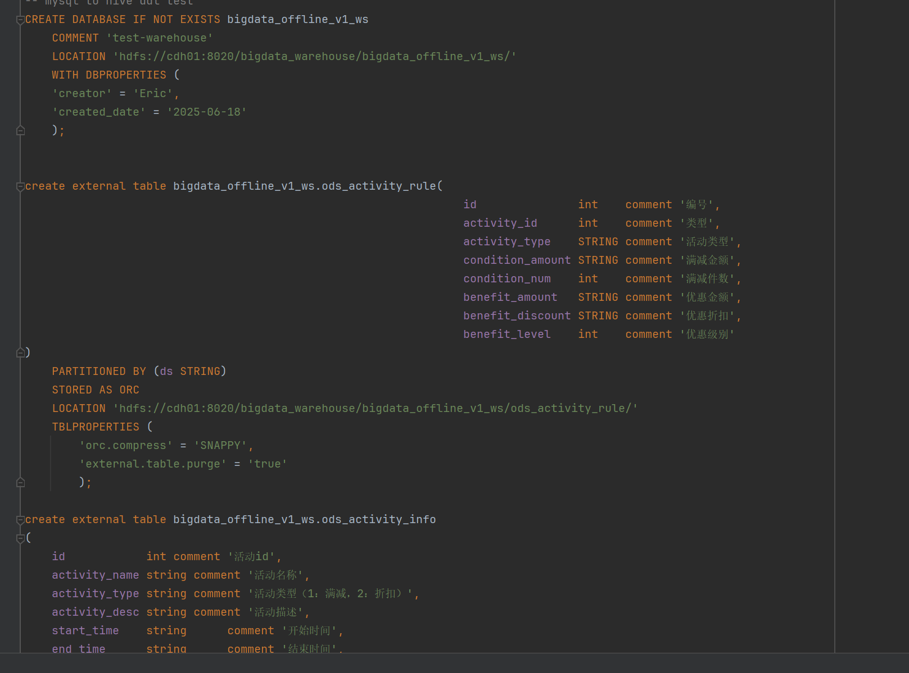
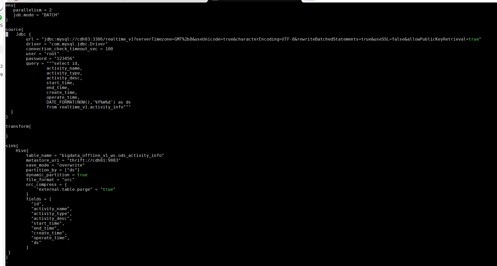
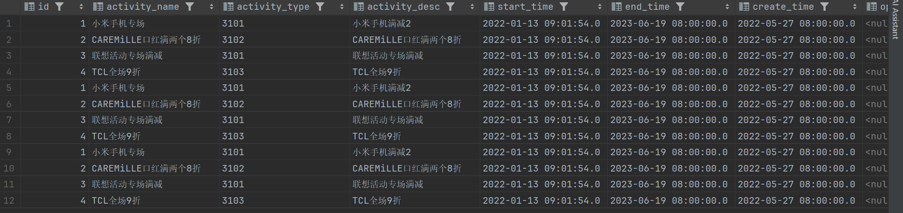
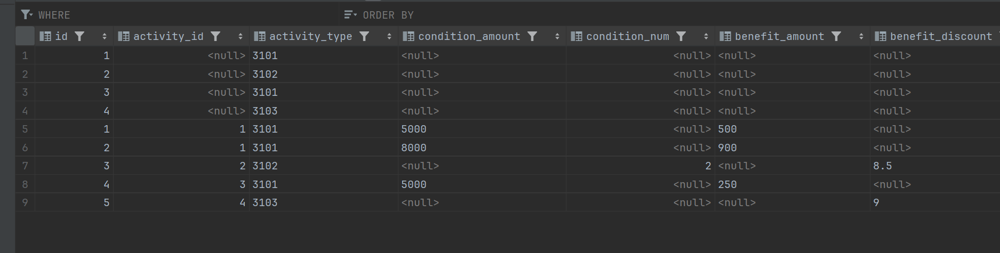

# offine_v1
offine_v1
赵克 2025 9.17
#今日学习
 
 CREATE DATABASE IF NOT EXISTS bigdata_offline_v1_ws
 COMMENT 'test-warehouse'
 LOCATION 'hdfs://cdh01:8020/bigdata_warehouse/bigdata_offline_v1_ws/'
 WITH DBPROPERTIES (
 'creator' = 'Eric',
 'created_date' = '2025-06-18'
 );

create external table bigdata_offline_v1_ws.ods_activity_rule(
id               int    comment '编号',
activity_id      int    comment '类型',
activity_type    STRING comment '活动类型',
condition_amount STRING comment '满减金额',
condition_num    int    comment '满减件数',
benefit_amount   STRING comment '优惠金额',
benefit_discount STRING comment '优惠折扣',
benefit_level    int    comment '优惠级别'
)
PARTITIONED BY (ds STRING)
STORED AS ORC
LOCATION 'hdfs://cdh01:8020/bigdata_warehouse/bigdata_offline_v1_ws/ods_activity_rule/'
TBLPROPERTIES (
'orc.compress' = 'SNAPPY',
'external.table.purge' = 'true'
);

create external table bigdata_offline_v1_ws.ods_activity_info
(
id            int comment '活动id',
activity_name string comment '活动名称',
activity_type string comment '活动类型（1：满减，2：折扣）',
activity_desc string comment '活动描述',
start_time    string      comment '开始时间',
end_time      string      comment '结束时间',
create_time   string      comment '创建时间',
operate_time  string      comment '修改时间'
)
PARTITIONED BY (ds STRING)
STORED AS ORC
LOCATION 'hdfs://cdh01:8020/bigdata_warehouse/bigdata_offline_v1_ws/ods_activity_info/'
TBLPROPERTIES (
'orc.compress' = 'SNAPPY',
'external.table.purge' = 'true'
);
 更改脚本将数据上传到hive
 
 实现了上传数据到hive
 
 