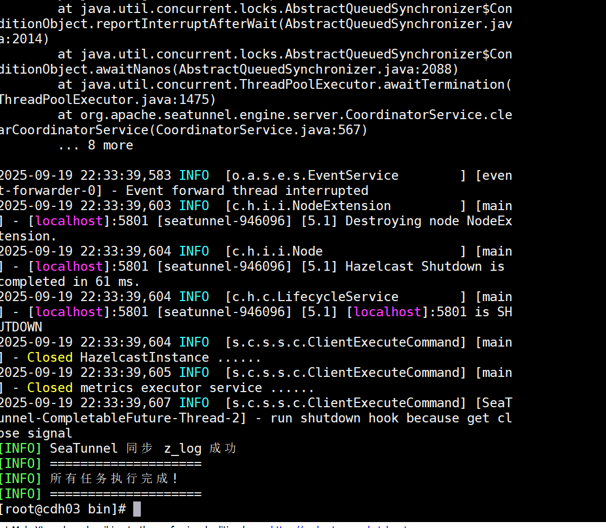
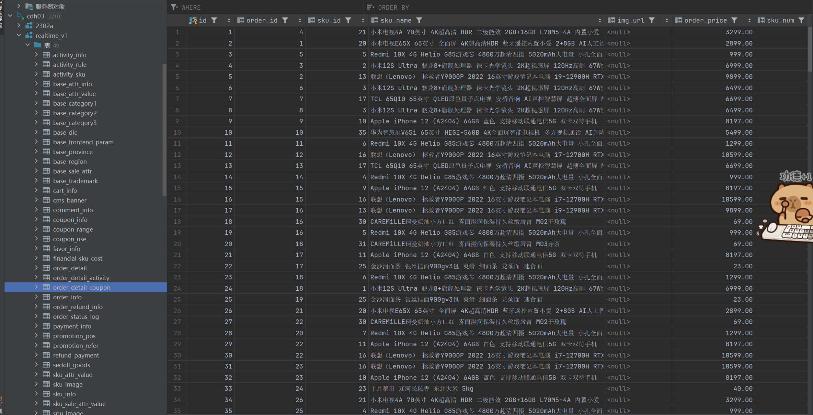

# offine_v1
offine_v1
赵克 2025 9.19
#今日学习
use realtime_v1_hive;
--商品维度表
DROP TABLE IF EXISTS dim_sku;
CREATE EXTERNAL TABLE dim_sku
(
`id`                   STRING COMMENT 'SKU_ID',
`price`                DECIMAL(16, 2) COMMENT '商品价格',
`sku_name`             STRING COMMENT '商品名称',
`sku_desc`             STRING COMMENT '商品描述',
`weight`               DECIMAL(16, 2) COMMENT '重量',
`is_sale`              BOOLEAN COMMENT '是否在售',
`spu_id`               STRING COMMENT 'SPU编号',
`spu_name`             STRING COMMENT 'SPU名称',
`category3_id`         STRING COMMENT '三级品类ID',
`category3_name`       STRING COMMENT '三级品类名称',
`category2_id`         STRING COMMENT '二级品类id',
`category2_name`       STRING COMMENT '二级品类名称',
`category1_id`         STRING COMMENT '一级品类ID',
`category1_name`       STRING COMMENT '一级品类名称',
`tm_id`                  STRING COMMENT '品牌ID',
`tm_name`               STRING COMMENT '品牌名称',
`sku_attr_values`      ARRAY<STRUCT<attr_id :STRING,
value_id :STRING,
attr_name :STRING,
value_name:STRING>> COMMENT '平台属性',
`sku_sale_attr_values` ARRAY<STRUCT<sale_attr_id :STRING,
sale_attr_value_id :STRING,
sale_attr_name :STRING,
sale_attr_value_name:STRING>> COMMENT '销售属性',
`create_time`          STRING COMMENT '创建时间'
) COMMENT '商品维度表'
PARTITIONED BY (`ds` STRING)
STORED AS ORC
LOCATION '/warehouse/gmall/dim/dim_sku/'
TBLPROPERTIES ('orc.compress' = 'snappy');

with
sku as
(
select
id,
price,
sku_name,
sku_desc,
weight,
is_sale,
spu_id,
category3_id,
tm_id,
create_time
from ods_sku_info
where ds='20250917'
),
spu as
(
select
id,
spu_name
from ods_spu_info
where ds='20250917'
),
c3 as
(
select
id,
name,
category2_id
from ods_base_category3
where ds='20250917'
),
c2 as
(
select
id,
name,
category1_id
from ods_base_category2
where ds='20250917'
),
c1 as
(
select
id,
name
from ods_base_category1
where ds='20250917'
),
tm as
(
select
id,
tm_name
from ods_base_trademark
where ds='20250917'
),
attr as
(
select
sku_id,
collect_set(named_struct('attr_id',attr_id,'value_id',value_id,'attr_name',attr_name,'value_name',value_name)) attrs
from ods_sku_attr_value
where ds='20250917'
group by sku_id
),
sale_attr as
(
select
sku_id,
collect_set(named_struct('sale_attr_id',sale_attr_id,'sale_attr_value_id',sale_attr_value_id,'sale_attr_name',sale_attr_name,'sale_attr_value_name',sale_attr_value_name)) sale_attrs
from ods_sku_sale_attr_value
where ds='20250917'
group by sku_id
)
insert overwrite table dim_sku partition(ds='20250917')
select
sku.id,
sku.price,
sku.sku_name,
sku.sku_desc,
sku.weight,
sku.is_sale,
sku.spu_id,
spu.spu_name,
sku.category3_id,
c3.name,
c3.category2_id,
c2.name,
c2.category1_id,
c1.name,
sku.tm_id,
tm.tm_name,
attr.attrs,
sale_attr.sale_attrs,
sku.create_time
from sku
left join spu on sku.spu_id=spu.id
left join c3 on sku.category3_id=c3.id
left join c2 on c3.category2_id=c2.id
left join c1 on c2.category1_id=c1.id
left join tm on sku.tm_id=tm.id
left join attr on sku.id=attr.sku_id
left join sale_attr on sku.id=sale_attr.sku_id;

--优惠券维度表
DROP TABLE IF EXISTS dim_coupon;
CREATE EXTERNAL TABLE dim_coupon
(
`id`                  STRING COMMENT '优惠券编号',
`coupon_name`       STRING COMMENT '优惠券名称',
`coupon_type_code` STRING COMMENT '优惠券类型编码',
`coupon_type_name` STRING COMMENT '优惠券类型名称',
`condition_amount` DECIMAL(16, 2) COMMENT '满额数',
`condition_num`     BIGINT COMMENT '满件数',
`activity_id`       STRING COMMENT '活动编号',
`benefit_amount`   DECIMAL(16, 2) COMMENT '减免金额',
`benefit_discount` DECIMAL(16, 2) COMMENT '折扣',
`benefit_rule`     STRING COMMENT '优惠规则:满元*减*元，满*件打*折',
`create_time`       STRING COMMENT '创建时间',
`range_type_code`  STRING COMMENT '优惠范围类型编码',
`range_type_name`  STRING COMMENT '优惠范围类型名称',
`limit_num`         BIGINT COMMENT '最多领取次数',
`taken_count`       BIGINT COMMENT '已领取次数',
`start_time`        STRING COMMENT '可以领取的开始时间',
`end_time`          STRING COMMENT '可以领取的结束时间',
`operate_time`      STRING COMMENT '修改时间',
`expire_time`       STRING COMMENT '过期时间'
) COMMENT '优惠券维度表'
PARTITIONED BY (`ds` STRING)
STORED AS ORC
LOCATION '/warehouse/gmall/dim/dim_coupon/'
TBLPROPERTIES ('orc.compress' = 'snappy');

insert overwrite table dim_coupon partition(ds='20250917')
select
id,
coupon_name,
coupon_type,
coupon_dic.dic_name,
condition_amount,
condition_num,
activity_id,
benefit_amount,
benefit_discount,
case coupon_type
when '3201' then concat('满',condition_amount,'元减',benefit_amount,'元')
when '3202' then concat('满',condition_num,'件打', benefit_discount,' 折')
when '3203' then concat('减',benefit_amount,'元')
end benefit_rule,
create_time,
range_type,
range_dic.dic_name,
limit_num,
taken_count,
start_time,
end_time,
operate_time,
expire_time
from
(
select
id,
coupon_name,
coupon_type,
condition_amount,
condition_num,
activity_id,
benefit_amount,
benefit_discount,
create_time,
range_type,
limit_num,
taken_count,
start_time,
end_time,
operate_time,
expire_time
from ods_coupon_info
where ds='20250917'
)ci
left join
(
select
dic_code,
dic_name
from ods_base_dic
where ds='20250917'
and parent_code='32'
)coupon_dic
on ci.coupon_type=coupon_dic.dic_code
left join
(
select
dic_code,
dic_name
from ods_base_dic
where ds='20250917'
and parent_code='33'
)range_dic
on ci.range_type=range_dic.dic_code;

--活动维度表
DROP TABLE IF EXISTS dim_activity;
CREATE EXTERNAL TABLE dim_activity
(
`activity_rule_id`   STRING COMMENT '活动规则ID',
`activity_id`         STRING COMMENT '活动ID',
`activity_name`       STRING COMMENT '活动名称',
`activity_type_code` STRING COMMENT '活动类型编码',
`activity_type_name` STRING COMMENT '活动类型名称',
`activity_desc`       STRING COMMENT '活动描述',
`start_time`           STRING COMMENT '开始时间',
`end_time`             STRING COMMENT '结束时间',
`create_time`          STRING COMMENT '创建时间',
`condition_amount`    DECIMAL(16, 2) COMMENT '满减金额',
`condition_num`       BIGINT COMMENT '满减件数',
`benefit_amount`      DECIMAL(16, 2) COMMENT '优惠金额',
`benefit_discount`   DECIMAL(16, 2) COMMENT '优惠折扣',
`benefit_rule`        STRING COMMENT '优惠规则',
`benefit_level`       STRING COMMENT '优惠级别'
) COMMENT '活动维度表'
PARTITIONED BY (`ds` STRING)
STORED AS ORC
LOCATION '/warehouse/gmall/dim/dim_activity/'
TBLPROPERTIES ('orc.compress' = 'snappy');

insert overwrite table dim_activity partition(ds='20250917')
select
rule.id,
info.id,
activity_name,
rule.activity_type,
dic.dic_name,
activity_desc,
start_time,
end_time,
create_time,
condition_amount,
condition_num,
benefit_amount,
benefit_discount,
case rule.activity_type
when '3101' then concat('满',condition_amount,'元减',benefit_amount,'元')
when '3102' then concat('满',condition_num,'件打', benefit_discount,' 折')
when '3103' then concat('打', benefit_discount,'折')
end benefit_rule,
benefit_level
from
(
select
id,
activity_id,
activity_type,
condition_amount,
condition_num,
benefit_amount,
benefit_discount,
benefit_level
from ods_activity_rule
where ds='20250917'
)rule
left join
(
select
id,
activity_name,
activity_type,
activity_desc,
start_time,
end_time,
create_time
from ods_activity_info
where ds='20250917'
)info
on rule.activity_id=info.id
left join
(
select
dic_code,
dic_name
from ods_base_dic
where ds='20250917'
and parent_code='31'
)dic
on rule.activity_type=dic.dic_code;

--地区维度表
DROP TABLE IF EXISTS dim_province;
CREATE EXTERNAL TABLE dim_province
(
`id`              STRING COMMENT '省份ID',
`province_name` STRING COMMENT '省份名称',
`area_code`     STRING COMMENT '地区编码',
`iso_code`      STRING COMMENT '旧版国际标准地区编码，供可视化使用',
`iso_3166_2`    STRING COMMENT '新版国际标准地区编码，供可视化使用',
`region_id`     STRING COMMENT '地区ID',
`region_name`   STRING COMMENT '地区名称'
) COMMENT '地区维度表'
PARTITIONED BY (`ds` STRING)
STORED AS ORC
LOCATION '/warehouse/gmall/dim/dim_province/'
TBLPROPERTIES ('orc.compress' = 'snappy');

insert overwrite table dim_province partition(ds='20250917')
select
province.id,
province.name,
province.area_code,
province.iso_code,
province.iso_3166_2,
region_id,
region_name
from
(
select
id,
name,
region_id,
area_code,
iso_code,
iso_3166_2
from ods_base_province
where ds='20250917'
)province
left join
(
select
id,
region_name
from ods_base_region
where ds='20250917'
)region
on province.region_id=region.id;

--营销坑位维度表
DROP TABLE IF EXISTS dim_promotion_pos;
CREATE EXTERNAL TABLE dim_promotion_pos
(
`id`                 STRING COMMENT '营销坑位ID',
`pos_location`     STRING COMMENT '营销坑位位置',
`pos_type`          STRING COMMENT '营销坑位类型 ',
`promotion_type`   STRING COMMENT '营销类型',
`create_time`       STRING COMMENT '创建时间',
`operate_time`      STRING COMMENT '修改时间'
) COMMENT '营销坑位维度表'
PARTITIONED BY (`ds` STRING)
STORED AS ORC
LOCATION '/warehouse/gmall/dim/dim_promotion_pos/'
TBLPROPERTIES ('orc.compress' = 'snappy');

insert overwrite table dim_promotion_pos partition(ds='20250917')
select
`id`,
`pos_location`,
`pos_type`,
`promotion_type`,
`create_time`,
`operate_time`
from ods_promotion_pos
where ds='20250917';

--营销渠道维度表
DROP TABLE IF EXISTS dim_promotion_refer;
CREATE EXTERNAL TABLE dim_promotion_refer
(
`id`                    STRING COMMENT '营销渠道ID',
`refer_name`          STRING COMMENT '营销渠道名称',
`create_time`         STRING COMMENT '创建时间',
`operate_time`        STRING COMMENT '修改时间'
) COMMENT '营销渠道维度表'
PARTITIONED BY (`ds` STRING)
STORED AS ORC
LOCATION '/warehouse/gmall/dim/dim_promotion_refer/'
TBLPROPERTIES ('orc.compress' = 'snappy');

insert overwrite table dim_promotion_refer partition(ds='20250917')
select
`id`,
`refer_name`,
`create_time`,
`operate_time`
from ods_promotion_refer
where ds='20250917';

--日期维度表
DROP TABLE IF EXISTS dim_date;
CREATE EXTERNAL TABLE dim_date
(
`date_id`    STRING COMMENT '日期ID',
`week_id`    STRING COMMENT '周ID,一年中的第几周',
`week_day`   STRING COMMENT '周几',
`day`         STRING COMMENT '每月的第几天',
`month`       STRING COMMENT '一年中的第几月',
`quarter`    STRING COMMENT '一年中的第几季度',
`year`        STRING COMMENT '年份',
`is_workday` STRING COMMENT '是否是工作日',
`holiday_id` STRING COMMENT '节假日'
) COMMENT '日期维度表'
STORED AS ORC
LOCATION '/warehouse/gmall/dim/dim_date/'
TBLPROPERTIES ('orc.compress' = 'snappy');

DROP TABLE IF EXISTS tmp_dim_date_info;
CREATE EXTERNAL TABLE tmp_dim_date_info (
`date_id`       STRING COMMENT '日',
`week_id`       STRING COMMENT '周ID',
`week_day`      STRING COMMENT '周几',
`day`            STRING COMMENT '每月的第几天',
`month`          STRING COMMENT '第几月',
`quarter`       STRING COMMENT '第几季度',
`year`           STRING COMMENT '年',
`is_workday`    STRING COMMENT '是否是工作日',
`holiday_id`    STRING COMMENT '节假日'
) COMMENT '时间维度表'
ROW FORMAT DELIMITED FIELDS TERMINATED BY '\t'
LOCATION '/warehouse/gmall/tmp/tmp_dim_date_info/';

insert overwrite table dim_date select * from tmp_dim_date_info;
select * from dim_date;

--用户维度表
DROP TABLE IF EXISTS dim_user_zip;
CREATE EXTERNAL TABLE dim_user_zip
(
`id`           STRING COMMENT '用户ID',
`name`         STRING COMMENT '用户姓名',
`phone_num`    STRING COMMENT '手机号码',
`email`        STRING COMMENT '邮箱',
`user_level`   STRING COMMENT '用户等级',
`birthday`     STRING COMMENT '生日',
`gender`       STRING COMMENT '性别',
`create_time`  STRING COMMENT '创建时间',
`operate_time` STRING COMMENT '操作时间',
`start_date`   STRING COMMENT '开始日期',
`end_date`     STRING COMMENT '结束日期'
) COMMENT '用户维度表'
PARTITIONED BY (`ds` STRING)
STORED AS ORC
LOCATION '/warehouse/gmall/dim/dim_user_zip/'
TBLPROPERTIES ('orc.compress' = 'snappy');

